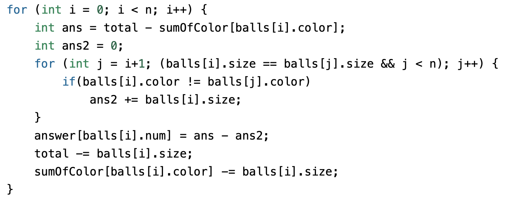

# 10800. 컬러볼

[문제링크](https://www.acmicpc.net/problem/10800)

## 알고리즘 분류
- 정렬

## 풀이 과정

### 1. 저장 [Input]
- 입력 데이터가 들어오는 순간 저장할 정보는 다음과 같다.
	- Ball {num, color, size}가 저장된 배열 (balls)
	- 색을 인덱스로 하는 색깔 별 크기의 합을 저장하는 배열 (sumOfColor)
	- 전체 공의 크기 합 (total)
	- 정답을 저장하는 배열 (answer)

### 2. 정렬 [O(nlogn)]
- 공을 크기 순으로 정렬한다.

### 3. 계산 [O(n)]
- balls 배열에서 위에 있을 수록 크기가 큰 공이다.
- 그 공이 삼킬 수 있는 모든 공의 크기 합은 다음과 같이 계산한다.

- for문 한 번만 돌면 되므로 계산하는데 O(n)시간 걸린다.

## Time & Space complexity
- Time (O(NlogN)
- Space (O(colors))

## 결과
|Language|Memory(KB)|Time(ms)|Code|
|-------|-------|----|----|
|C++|5,892|128|1291|

